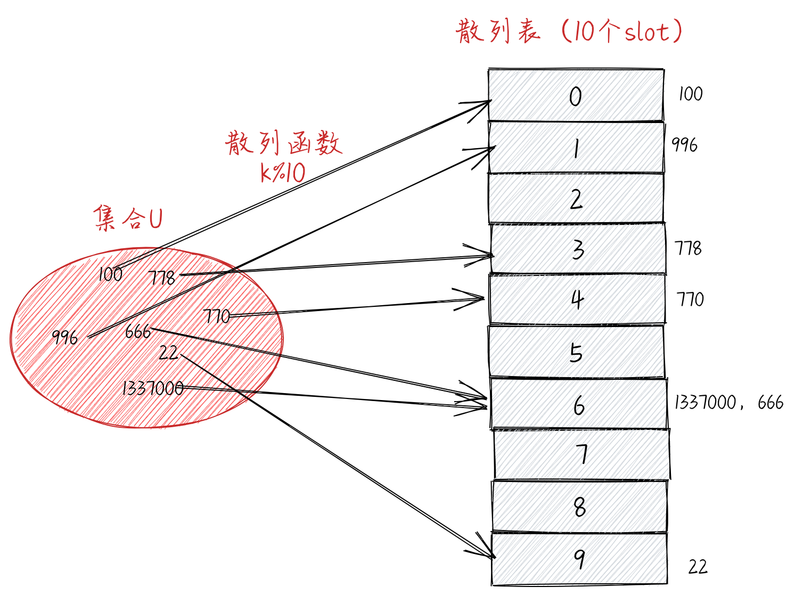
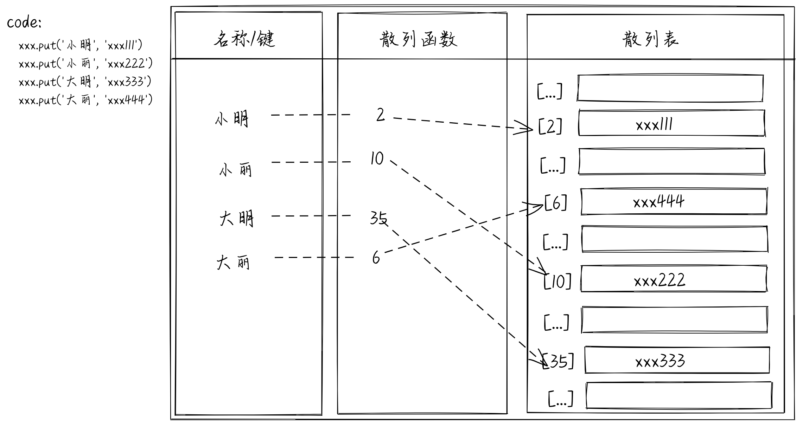
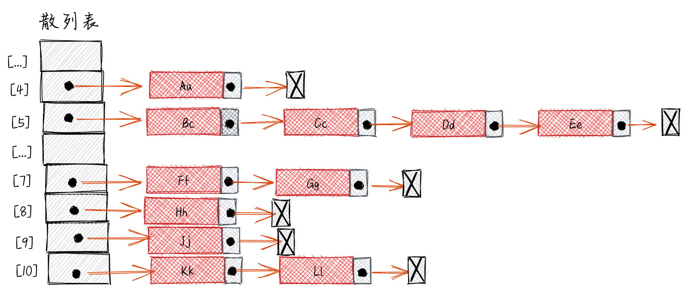
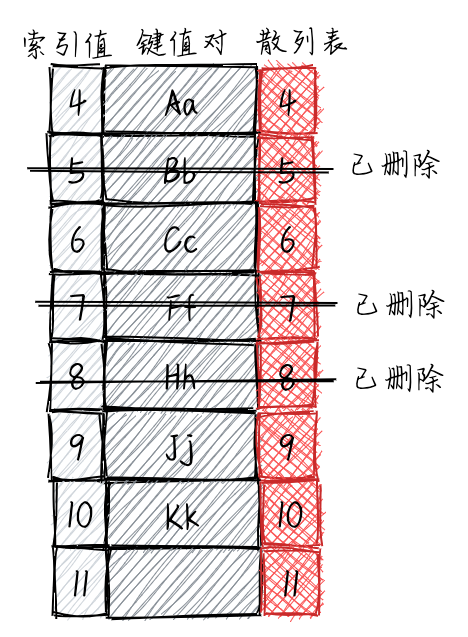
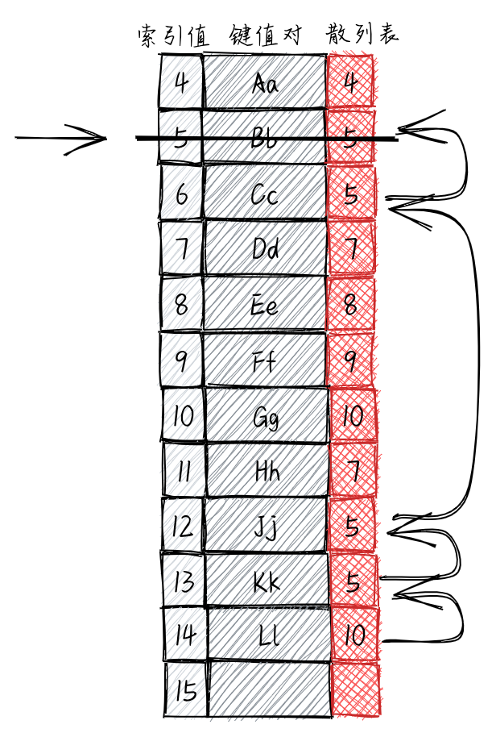

## 散列表（哈希表）

### 散列表（哈希表）

**散列表（哈希表）的定义**

> HashTable 类也叫 HashMap 类，它是 Dictionary 类的一种散列表（哈希表）实现方式。HashTable 是一种根据关键字（key）直接访问内存存储位置的数据结构，通过散列表（哈希表），数据元素的存放位置和数据元素的关键字之间建立起某种对应关系，建立这种对应关系的函数称为散列（哈希）函数，存放记录的数组称作散列表（哈希表）

**散列表（哈希表）的工作原理**



**散列表（哈希表）的实现**

**[`HashTable Demo`](./hash-table.js)**

> 实现了以下功能

```
put(key, value) 向散列表增加一个新的项（也能是更新散列表）
remove(key) 根据键值从散列表中移除值
get(key) 返回根据键值检索到的特定的值
```

**`图解`**



### 散列表（哈希表）中的冲突

**散列表（哈希表）中的冲突含义**

> 有时候，一些键会有相同的散列值。不同的值在散列表中对应相同位置的时候，我们称其为`冲突`

**解法一：分离链接**

> 分离链接法包括为散列表的每一个位置创建一个链表并将元素存储在里面。它是解决冲突的最简单的方法。



**分离链接的实现**

**[`HashTableSeparateChaining Demo`](./hash-table-separate-chaining.js)**

**解法二：线性探查**

> 线性探查也称作线性，是因为它处理冲突的方式是将元素直接存储到表中，而不是在单独的数据结构中。线性探查法在向散列表中插入元素时，如果插入位置 position 已经被占据，就尝试插入 position+1 的位置，以此类推，直到找到空的位置。

**线性探查(软删除)**


**[`HashTableLinearProbing Demo`](./hash-table-linear-probing.js)**

**线性探查(惰性删除)**

> 需要检验是否有必要讲一个或多个元素移动到之前的位置。当搜索一个键的时候，这种方法可以避免找到一个空位置，如果移动元素是必要的，我们就需要在散列表中挪动键值对。



**[`HashTableLinearProbingLazy Demo`](./hash-table-linear-probing-lazy.js)**

线性探查的两种方法都有各自的优缺点
