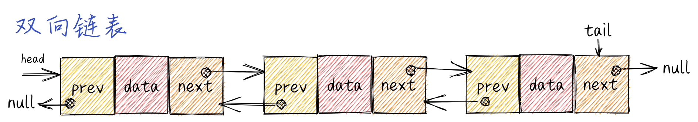
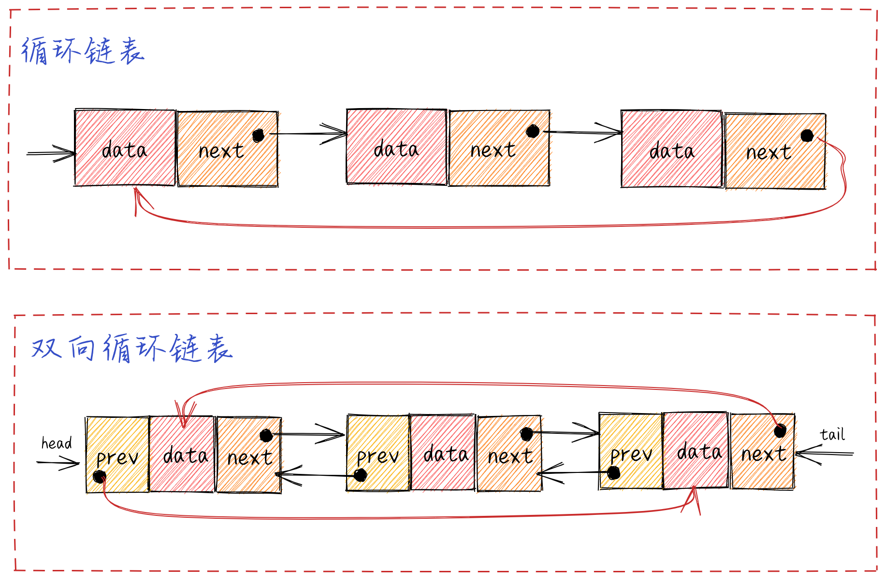

## 链表

### 链表

**链表的定义**

> 链表存储有序的元素集合，但不同于数组，链表中的元素在内存中并`不是连续放置的`。每个元素由一个存储元素本身的节点和一个指向下一个元素的引用（也称指针或链接）组成

**链表的工作原理**

**链表的实现**

**[`LinkedList Demo`](./linked-list.js)**

### 双向链表

**双向链表的定义**

> 在双向链表中，链接（指针）是双向的：一个链向下一个元素，一个链向前一个元素

**双向链表的工作原理**

**双向链表的实现**

**[`DoublyLinkedList Demo`](./doubly-linked-list.js)**

### 循环链表

**循环链表的定义**

> 循环链表可以像链表一样只有单向引用，也可以像双向链表一样有双向引用。循环链表和链表之间唯一的区别在于，最后一个元素指向下一个元素的指针（tail.next）不是 null，而是指向第一个元素（head）

**循环链表的工作原理**

**循环链表的实现**

**[`CircularLinkedList Demo`](./circular-linked-list.js)**

### 有序链表

**有序链表的定义**

> 有序链表是指保持元素有序的链表结构

**有序链表的实现**

**[`SortedLinkedList Demo`](./sorted-linked-list.js)**

### 拓展

**联表实现栈**

**[`StackLinkedList Demo`](./stack-linked-list.js)**
