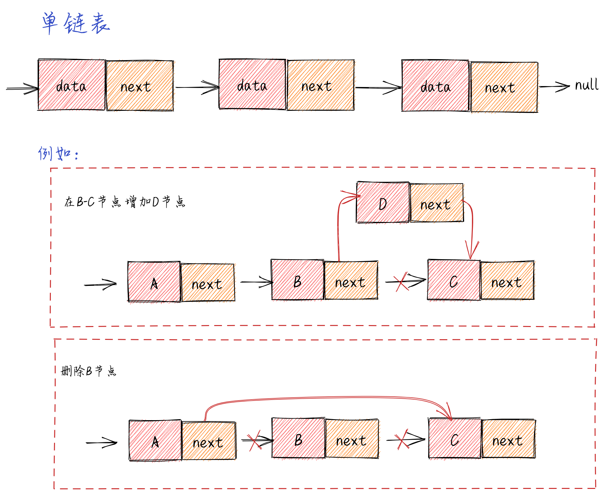

## 链表

### 链表

**链表的定义**

> 链表存储有序的元素集合，但不同于数组，链表中的元素在内存中并`不是连续放置的`。每个元素由一个存储元素本身的节点和一个指向下一个元素的引用（也称指针或链接）组成

**链表的工作原理**

**链表的实现**

**[`demo`](./linked-list.js)**

### 双向链表

**双向链表的定义**

### 循环链表

**循环链表的定义**

### 排序链表

**排序链表的定义**

### 拓展

**联表实现栈**
