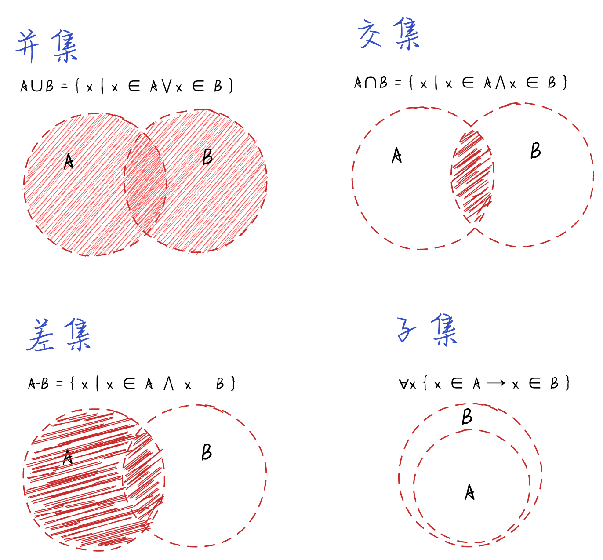

## 集合

**集合的定义**

> 集合使用由一组`无序且唯一（即不能重复）`的项组成。可以把集合想象成一个既没有重复元素，也没有顺序概念的数组。

**集合的实现**

**[`Set Demo`](./set.js)**

> 实现了以下功能

```
add(element) 向集合添加一个新元素
delete(element) 从集合移除一个新元素
has(element) 如果元素在集合中，返回true, 否则返回false
clear() 移除集合中的所有元素
size() 返回集合所包含元素的数量，它与数组的length属性相似。
values() 返回一个包含集合中所有值（元素）的数组
```

**集合运算**

> 实现了以下功能

```
并集：对于给定的两个集合，返回一个包含两个集合中所有元素的新集合
交集：对于给定的两个集合，返回一个包含两个集合中共有元素的新集合
差集：对于给定的两个集合，返回一个包含所有存在与第一个集合且不存在于第二个集合的元素的新集合
子集：验证一个给定集合是否是另一个集合的子集
```

**[`SetOperation Demo`](./set-operation.js)**

**集合运算概念**


