## 树

### 树的概念

**数的概念**

> 数是一种分层数据的抽象模型，有点像一个公司的组织架构

**数的结构**

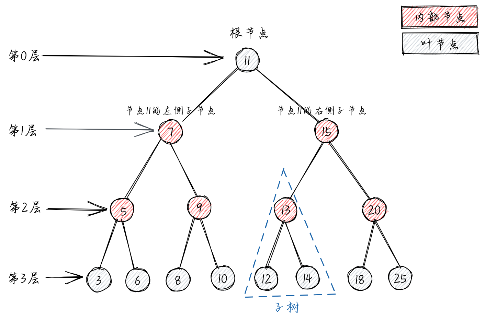

### 二叉树

**二叉树的定义**

> 二叉树中的节点最多只能有两个字节点：一个是左侧子节点，另一个是右侧子节点。左右侧子节点的顺序不能颠倒。因此，二叉树中不存在大于 2 的节点。

### 二叉搜索树

**二叉搜索树的定义**

> 二叉搜索树（BST - Binary Search Tree）是二叉树中的一种，它规定在左侧子节点上存储（比父节点）小的值，在右侧子节点上存储（比父节点）大的值。如上图

**二叉搜索树的实现**

**[`BinarySearchTree Demo`](./binary-search-tree.js)**

> 实现了以下功能

```
insert(key) 向数中插入一个新的键
search(key) 在树中查找一个键。如果节点存在，则返回true，否则返回false
inOrderTraverse() 通过中序遍历方式遍历所有节点
preOrderTraverse() 通过先序遍历方法遍历所有节点
postOrderTraverse() 通过后序遍历方式遍历所有节点
min() 返回树中最小的值/键
max() 返回树中最大的值/键
remove(key) 从树中移除某个键
```

### 树的遍历

**先序遍历**

> 先序遍历（NLR - Preorder Traverse），访问根节点的操作发生在遍历其左右子树之前。是以优先于后代节点的顺序访问每个节点，先序遍历的一种应用是打印一个结构化的文档
> 具体实现看`BinarySearchTree Demo`中的`preOrderTraverse`函数

**中序遍历**

> 中序遍历（LNR - Inorder Traverse），访问根节点的操作发生在遍历其左右子树之间。是一种以上行顺序访问 BST 所有节点的遍历方式，也就是以最小到最大的顺序访问所有节点。中序遍历的一种应用就是对树进行排序操作。
> 具体实现看`BinarySearchTree Demo`中的`inOrderTraverse`函数

**后序遍历**

> 后序遍历（LRN - Postorder Traverse），访问根节点的操作发生在其左右子树之后，是先访问节点的后代节点，再访问节点本身。后序遍历的一种应用是计算一个目录及其子目录中所有文件所占空间的大小
> 具体实现看`BinarySearchTree Demo`中的`postOrderTraverse`函数

### 自平衡树

> 上面的 BST 树（二叉搜索树）存在一个问题，树的一条边可能会非常深，而其它边却只有几层，这会在这条很深的分支上添加、移除和搜索节点时引起一些性能问题。

如下图：
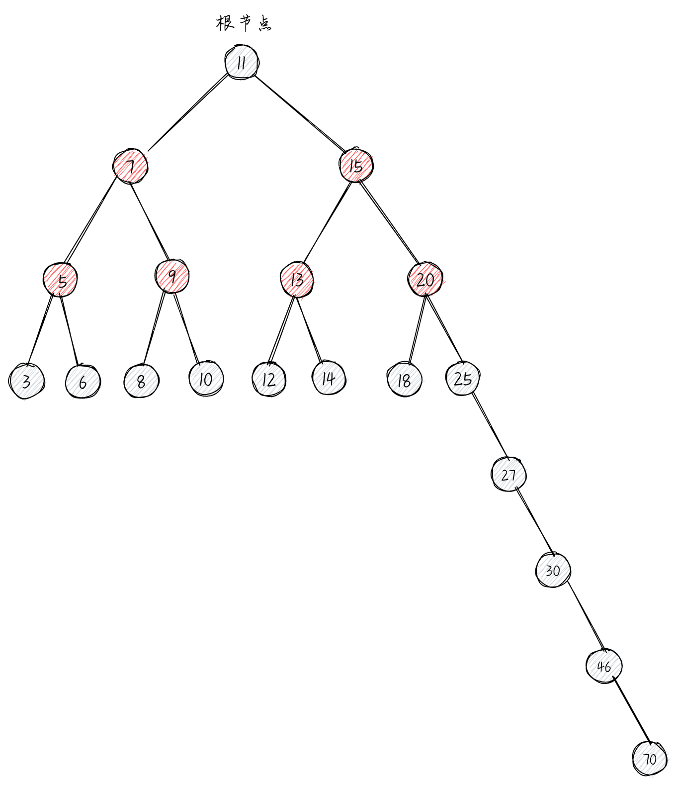

所以引出了 AVL 树

**Adelson-Velskii-Landi 树（AVL 树）**

> AVL 树是一种自平衡树。添加或移除节点时，AVL 树会尝试保持自平衡。任意一个节点（无论深度）的左子树和右子树高度最多相差 1。添加或移除节点时，AVL 树会尽可能尝试转换为完全树

**AVL 树的平衡因子**

> `节点的平衡因子 = 左子树的高度 - 右子树的高度`

如下图：红色既每个节点的平衡因子的值。AVL 树的所有节点的平衡因子保持三个值：0、+1 或-1

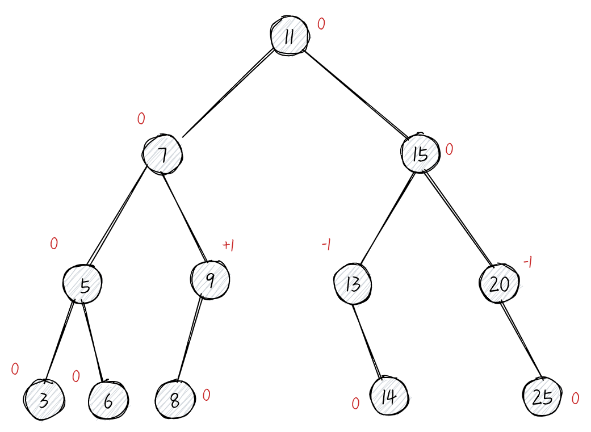

**AVL 树的旋转（平衡操作）**

- 左-左（LL - left-left）：向右的单旋转。
  > 新添加的节点位于树的根节点的左子树的左子树上。以非平衡因子的节点为中心将整棵树向右旋转。
  > 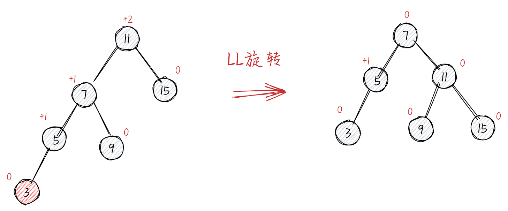
- 右-右（RR - right-right）：向左的单旋转
  > 新添加的节点位于树的根节点的右子树的右子树上。以非平衡因子的节点为中心将整棵树向左旋转。
  > 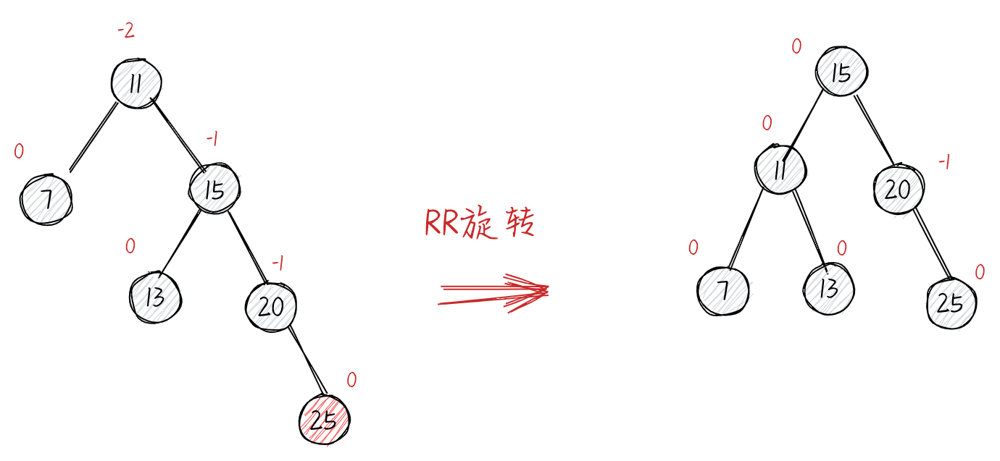
- 左-右（LR - left-right）：向右的双旋转（先 LL 旋转，再 RR 旋转）
  > 新添加的节点位于树的根节点的左子树的右子树上。先执行 RR 旋转，然后再执行 LL 旋转。
  > 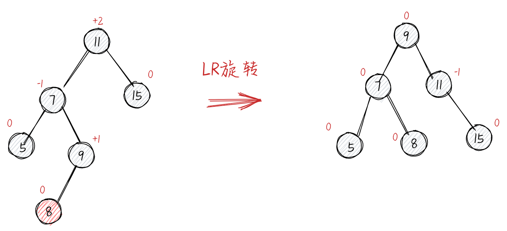
- 右-左（RL - right-left）：向左的双旋转（先 RR 旋转，再 LL 旋转）
  > 新添加的节点位于树的根节点的右子树的左子树上。先执行 LL 旋转，然后再执行 RR 旋转。
  > 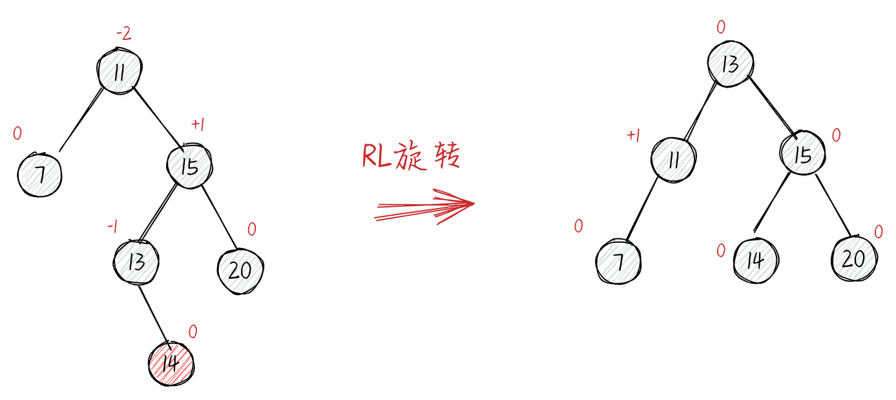

**AVL 树的实现**

**[`AVLTree Demo`](./avl-tree.js)**

**红黑树**

> 红黑树也是一个自平衡二叉搜索树。对 AVL 树插入和移除节点可能会造成旋转，所以我们需要一个包含多次插入和删除的平衡树，红黑树是比较好的。如果插入和删除的频率比较低（我们更需要多次进行搜索操作），那么 AVL 树比红黑树更好。

**红黑树规则**

- 顾名思义，每个节点不是红的就是黑的
- 树的根节点是黑的
- 所有叶节点都是黑的（用 NULL 引用表示的节点）
- 如果一个节点是红的，那么它的两个子节点都是黑的
- 不能有两个相邻的红节点，一个红节点不能有红的父节点或子节点
- 从给定的节点到它的后代节点（NULL 叶节点）的所有路径包含相同数量的黑色节点

如下图：

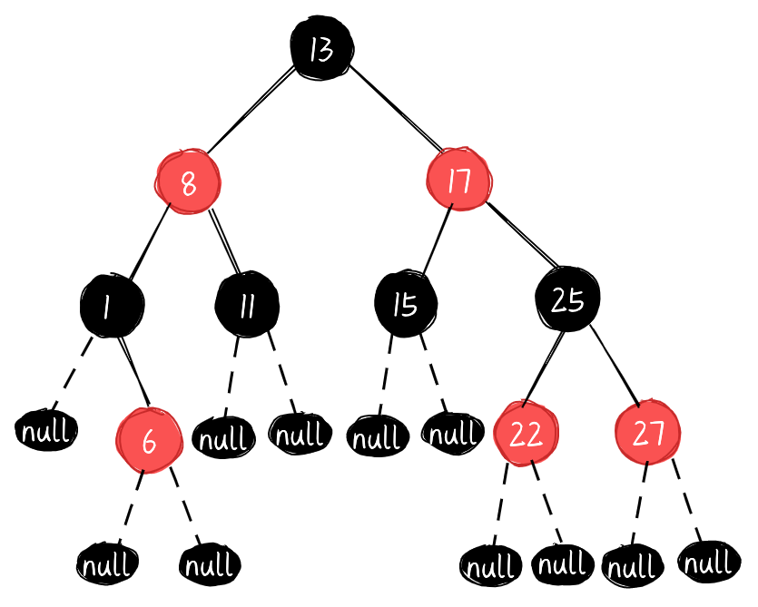

**红黑树的旋转（平衡操作）**

- 左-左（LL）：父节点是祖父节点的左侧子节点，节点是父节点的左侧子节点

  > 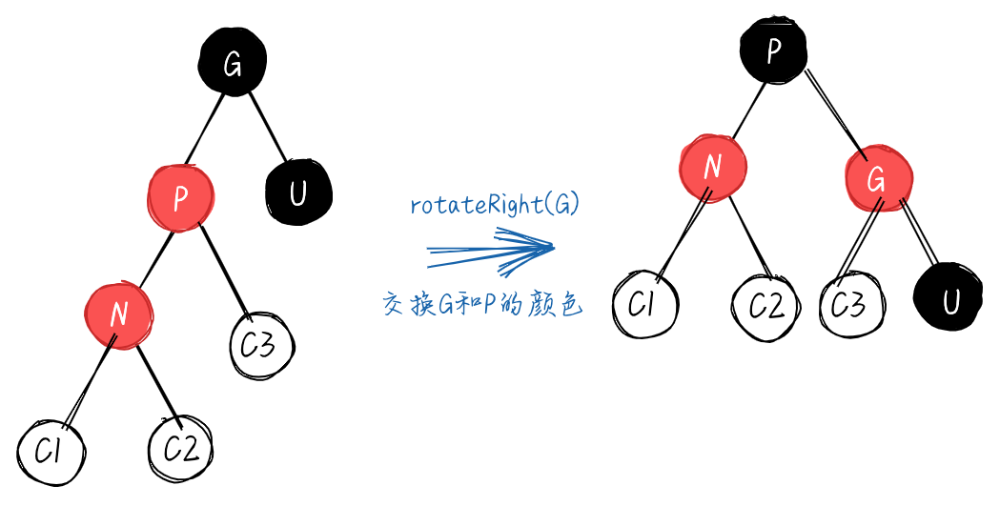

- 左-右（LR）：父节点是祖父节点的左侧子节点，节点是父节点的右侧子节点

  > 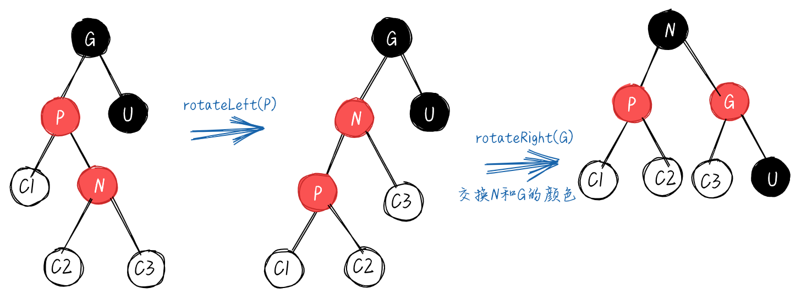

- 右-右（RR）：父节点是祖父节点的右侧子节点，节点是父节点的右侧子节点

  > 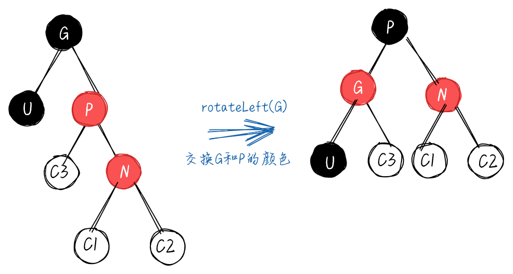

- 右-左（RL）：父节点是祖父节点的右侧子节点，节点是父节点的左侧子节点
  > 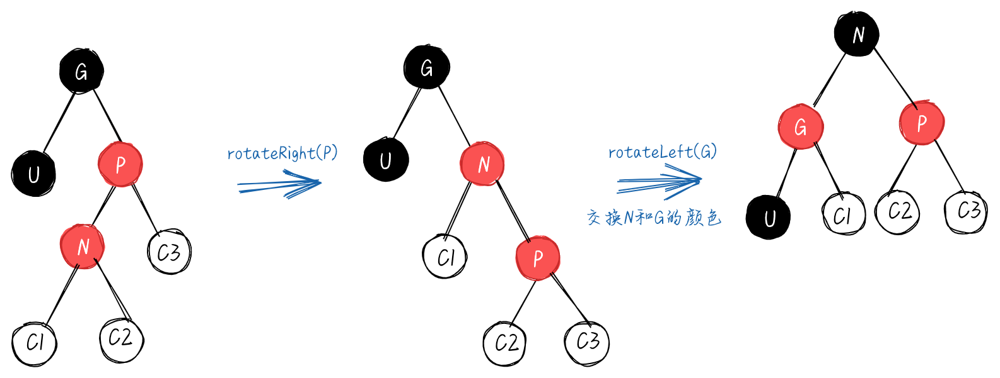

**红黑树的实现**

> 实现了以下功能

```
rotationLL(node) 左-左（右旋转）
rotationRR(node) 右-右（左旋转）
```

**[`RedBlackTree Demo`](./red-black-tree.js)**
