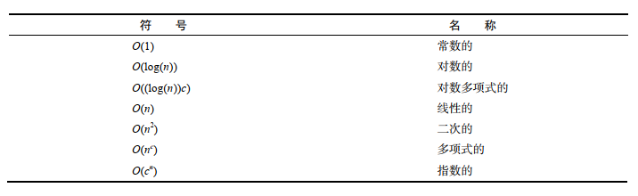
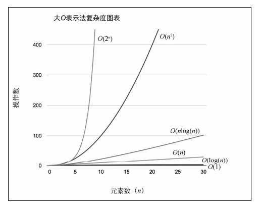
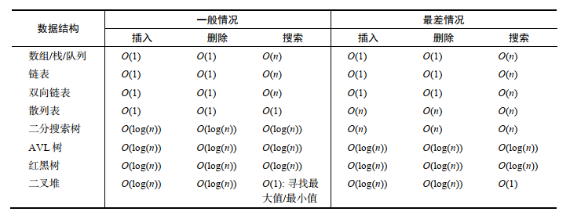

## 算法复杂度

### 大 O 表示法

> 大 O 表示法用于描述算法的性能和复杂程度。大 O 表示法将算法按照消耗的时间进行分类，依据输入增大所需要的空间/内存。

**分析算法时，时常遇到以下几类函数**


**理解大 O 表示法**

> 如何衡量算法的效率？通常是资源，例如 CPU（时间）占用、内存占用、硬盘占用和网络占用。当讨论大 O 表示法时，一般考虑的是 CPU（时间）占用

- O(1)

```js
function increment(num) {
  return ++num;
}
```

假设运行 increment(1)，执行时间等于 x。如果再用不同的参数（例如 2）运行一次 increment 函数，执行时间依然是 X，和参数无关，increment 函数的性能都一样，因此，我们说上述函数的复杂度是 O(1) （常数）

- O(n)
  以顺序搜索算法为例

```js
function sequentialSearch(array, value) {
  for (let i = 0; i < array.length; i++) {
    if (value == array[i]) {
      // {1}
      return i;
    }
  }
  return -1;
}
```

如果将含 10 个元素的数组（[1,..., 10]）传递给该函数，假如搜索 1 这个元素，那么第一次判断时就能找到想要搜索的元素。在这里我们假设每执行一次行{1}，开销是 1。

现在，假如要搜索元素是 11，行{1}会执行 10 次，开销就是 10；假如该数组有 1000 个元素（[1,..., 1000]），我们搜索 1001 的结果是执行行{1}1000 次，开销为 1000。

可以得出，顺序搜索算法的时间复杂度就是 O(n)，n 是数组的大小

- O(n^2)
  以冒泡排序为例

```js
function bubbleSort(array) {
  const { length } = array;
  for (let i = 0; i < length; i++) {
    for (let j = 0; j < length; j++) {
      if (array[j] > array[j + 1]) {
        swap(array, j, j + 1); // 交换元素
      }
    }
  }
  return array;
}
```

如果用大小为 10 的数组执行 bubbleSort，开销是 100（10^2）。如果用大小为 100 的数组执行 bubbleSort，开销就是 10000（100^2）。

注意：时间复杂度 O(n)的代码只有一层循环，而 O(n^2)的代码有双层嵌套循环，如果算法有三层迭代数组的嵌套循环，它的时间复杂度很可能就是 O(n^3)

### 时间复杂度

我们可以创建一个表格来表示不同的时间复杂度


我们可以基于上表信息画一个图来表示不同的 daO 表示法的消耗  
  
或  
  

下面我们把一些常见的时间复杂度以表格展示出来  

1. 数据结构  
   
2. 图  
   
3. 排序算法  
   
4. 搜索算法  
   
