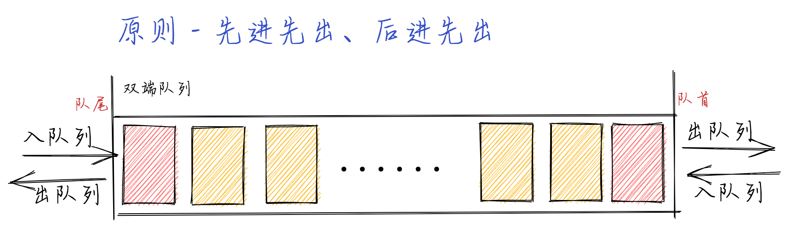

## 队列和双端队列

### 队列

**队列的定义**

> 队列是遵循`先进先出（FIFO，也称为先来先服务）`原则的一组有序的项。队列在尾部添加新元素，并从顶部移除元素。最新添加的的元素必须排在队列的尾部。

> 队列是一种特殊的线性表，特殊之处在于它只允许在表的[前端]进行删除操作，而在表的[后端]进行插入操作，和栈一样，队列是一种操作受限制的线性表。进行插入操作的端称为队尾，进行删除操作的端称为队首。队列的数据元素又称为队列元素。在队列中插入一个队列元素称为入队，从队列中删除一个队列元素称为出队。

**队列的工作原理**


**队列的实现**

> 从数据存储的角度看，实现队列有两种方式，一种是以数组做基础，一种是以链表做基础，数组是最简单的实现方式，本文以基础的数组来实现队列。队列的基本操作包括：创建队列、销毁队列、入队、出队、清空队列、获取队头元素、获取队列的长度。

**[`demo - object`](./queue.js)**

> 实现了以下功能

```
enqueue(element(s)) 向队列尾部添加一个（或多个）新的项
dequeue() 移除队列的第一项（即排在队列最前面的项），并返回被移除的元素
peek()/front() 返回队列中的第一个元素 - 最先被添加，也将是最先被移除的元素。队列不做任何变动
isEmpty() 如果队列里没有任何元素就返回true，否则返回false
size() 返回队列里元素的个数
clear() 移除队列里所有元素
```

### 双端队列

**双端队列的定义**

> 双端队列（deque，或称 double-ended queue）是一种允许我们同时从前端和后端添加或者移除元素的特殊队列

> 双端队列在生活中的例子：去电影院看电影，在排队进场【 x(n), x(n-1) ... x2, x1】，结果 x(n)要回去加班了然后 x(n)就推出了这个队伍，然后新来了一个 y1 排了进去【 y1, x(n-1) ... x2, x1】,另外 x1 的也是如此，即进场和插队的。在计算机科学中双端队列最常见的应用就是 存储一系列的撤销操作。双端队列同时遵循`先进先出、后进先出`的原则

**队列的工作原理**



**[`demo - object`](./queue.js)**

> 实现了以下功能

```
addFront(element) 该方法在双端队列前端添加新的元素
addBack(element) 该方法在双端队列后端添加新的元素（实现方法和Queue类中的enqueue方法相同）
removeFront() 该方法会从双端队列前端移除第一个元素（实现方法和Queue类中的dequeue方法相同）
removeBack() 该方法会从双端队列后端移除第一个元素（实现方法和Queue类中的pop方法一样）
peekFront() 该方法返回双端队列前端的第一个元素（实现方法和Queue类的中的peek方法一样）
peekBack() 该方法返回双端队列后端的第一个元素（实现方法和Stack类中的peek方法一样）
```
